这篇博文记录了我完成 C++ 课程设计的完整过程——一个名为"Rolex"的应聘者招聘评分系统。文章从需求规格出发，依次展示数据流程图、程序结构图、核心数据结构与评分算法，最后附上使用说明和测试要点。如果你正在做类似的 C++ 课程设计，或者想了解如何把一个控制台程序从需求文档一步步落地为可运行代码，这篇文章应该能提供一些参考。

## 项目背景与目标

为了公平、公正、公开地选拔副局长岗位人才，需要建立一套自动化的评分系统。系统根据应聘者的基本信息（年龄、学历、工作经历）及考试成绩（笔试五科、口试），按照预设的权重和算法计算总分，并自动生成排名和录取名单。

传统的"人工核算、手工排序"模式效率低下，且存在主观干扰、计算疏漏及数据篡改等潜在风险。本系统旨在通过标准化算法引擎，深度整合应聘者的多维画像数据——既涵盖年龄结构、学历层次、任职年限等硬性资历指标，又全面纳入笔试五科及结构化口试的动态成绩数据，以技术理性捍卫制度正义。

### 适用范围

- 适用于人事部门进行初步筛选和模拟录取
- 支持最多 50 名应聘者的数据处理
- 所有分数计算保留两位小数
- 姓名长度限制 20 字符以内，工作单位限制 60 字符以内

### 运行环境

- **操作系统**：Windows / Linux / macOS
- **编译环境**：支持 C++11 及以上标准的编译器（GCC、Clang、MSVC）
- **交互方式**：控制台文本交互
- **依赖**：仅依赖 C++ 标准库，无第三方依赖

## 功能需求概览

系统共包含五大功能模块，下面逐一说明。

### 数据录入

系统提示用户输入应聘者人数 $n$，若 $n \le 0$ 或 $n > 50$ 则报错并终止。随后循环接收每位应聘者的详细信息：

- 姓名、性别、年龄、学历（B/M/U/其他）
- 任科级干部年限、现工作单位
- 笔试成绩：政策法律基础、语文、英语、计算机基础
- 口试成绩

### 评分计算

系统按以下规则自动计算各项得分：

**学历分 ($S_{record}$)**

| 学历 | 代码 | 分值 |
| :--- | :--- | :--- |
| 博士 | B | 100 |
| 硕士 | M | 75 |
| 本科 | U | 50 |
| 其他 | - | 0 |

**年龄分 ($S_{age}$)**

年龄 < 30 按 30 计，> 55 按 55 计，中间采用分段线性插值：

| 年龄范围 | 计算公式 |
| :--- | :--- |
| $30 \le age \le 35$ | $70 + (age - 30) \times 2$ |
| $35 < age \le 40$ | $80 + (age - 35) \times 4$ |
| $40 < age \le 50$ | $100 - (age - 40) \times 2.5$ |
| $50 < age \le 55$ | $75 - (age - 50) \times 1$ |

**工作经历分 ($S_{wlen}$)**

| 年限范围 | 计算公式 |
| :--- | :--- |
| $\le 1$ 年 | 0 |
| $1 < 年限 < 2$ | $70 + (年限 - 1) \times 30$ |
| $2 \le 年限 \le 6$ | $100 - (年限 - 2) \times 20$ |
| $> 6$ 年 | 0 |

**总分 ($Total$)**

$$Total = (Pol + Chn + Eng + Com) + (Oral \times 2) + S_{record} + S_{age} + S_{wlen}$$

其中口试成绩权重为笔试单科的两倍。

### 排序与报表

所有应聘者录入并计算完毕后，系统按总分从高到低排序，以表格形式输出成绩总表，并自动选取前 5 名生成录取通知书。

### 查询功能

系统进入循环查询模式，用户输入姓名即可检索该应聘者的全部得分信息；输入 `exit` 退出查询。

## 数据结构设计

系统内部维护三个核心结构体，层层嵌套，职责清晰。

### 成绩结构体 Tmark

存储五科考试成绩：

```cpp
struct Tmark {
    float pol;   // 政策法律基础
    float chn;   // 语文
    float eng;   // 英语
    float com;   // 计算机基础
    float oral;  // 口试
};
```

### 个人信息结构体 Tinform

存储应聘者的基本资料，并内嵌一个 `Tmark` 存放原始成绩：

```cpp
struct Tinform {
    char name[20];        // 姓名
    char sex;             // 性别
    float age;            // 年龄
    char schoolrecord;    // 学历代码
    float worklen;        // 任职年限
    char wordsite[60];    // 现工作单位
    Tmark mark;           // 考试成绩
};
```

### 综合记录结构体 Tmarks

在 `Tinform` 基础上增加计算后的各项得分和最终总分：

```cpp
struct Tmarks {
    Tinform info;
    char name[20];        // 姓名副本（用于快速访问）
    float Sage;           // 年龄分
    float Srecord;        // 学历分
    float Swlen;          // 工作分
    Tmark mark;           // 考试成绩
    float total;          // 最终总分
};
```

这三个结构体的关系可以用下面的类图表示：

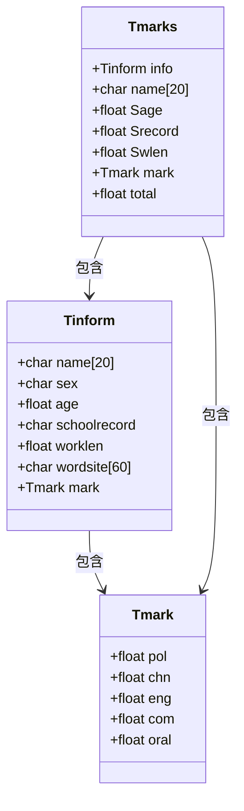

## 数据流程图

下面从顶层到细节，逐层展示系统的数据流转关系。

### 顶层数据流程图（上下文图）

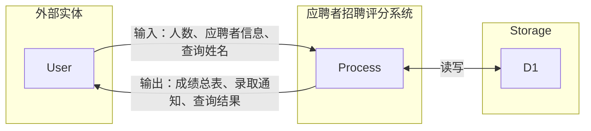

### 0 层数据流程图

将系统分解为五个处理过程：

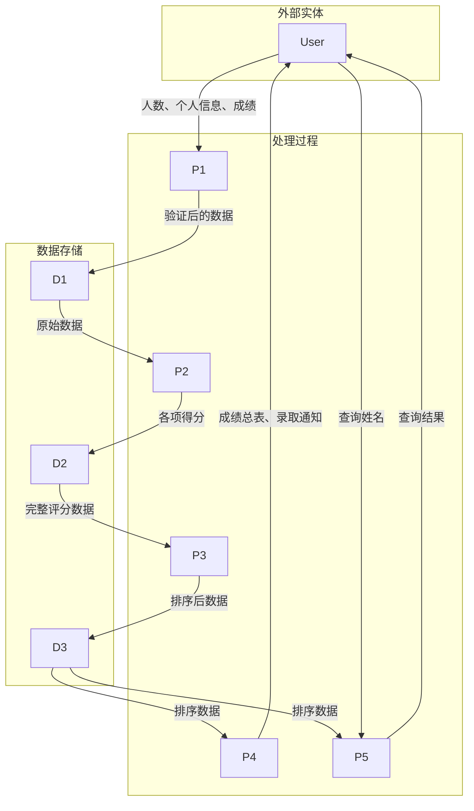

### 1 层数据流程图

进一步细化每个处理过程的内部逻辑。

**信息录入与验证模块 (1.1)**

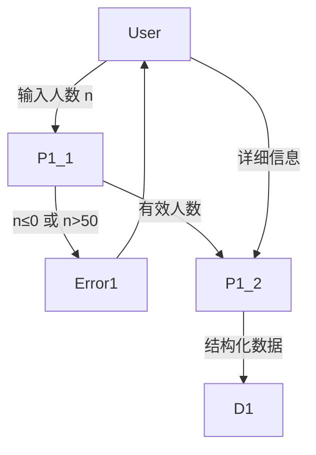

**分数计算模块 (1.2)**

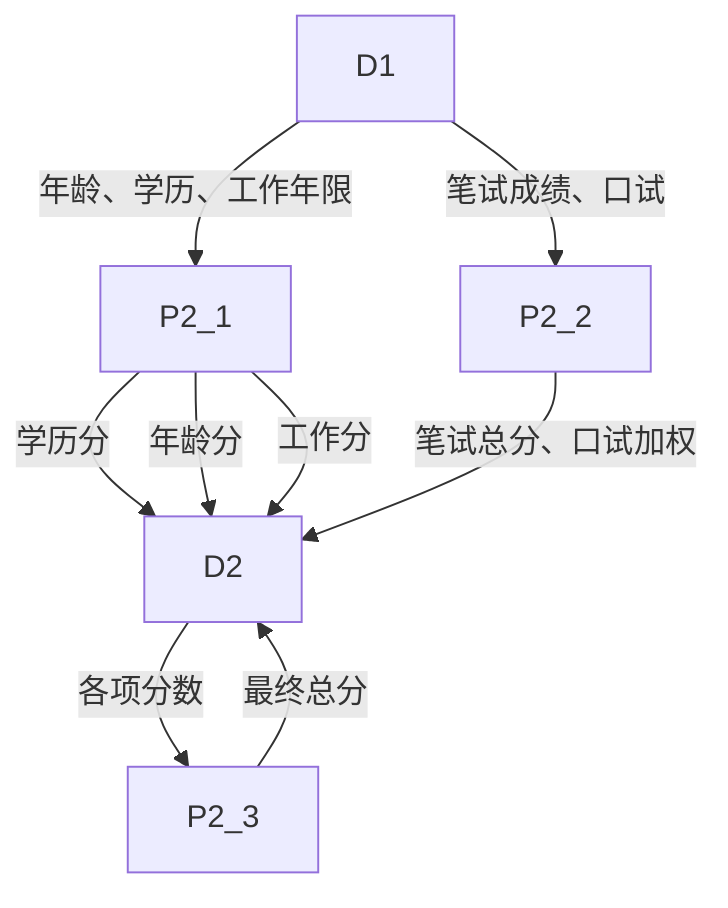

**排序处理模块 (1.3)**

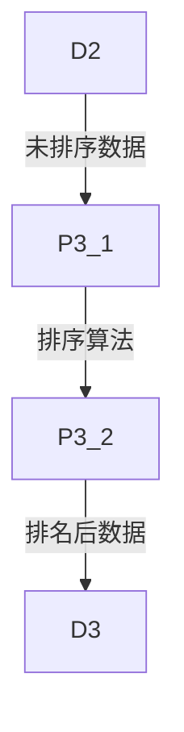

**报表输出模块 (1.4)**

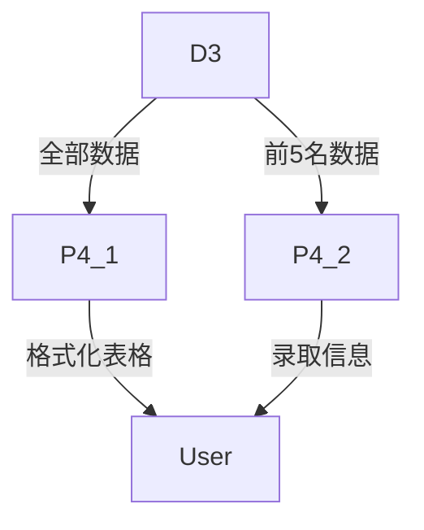

**信息查询模块 (1.5)**

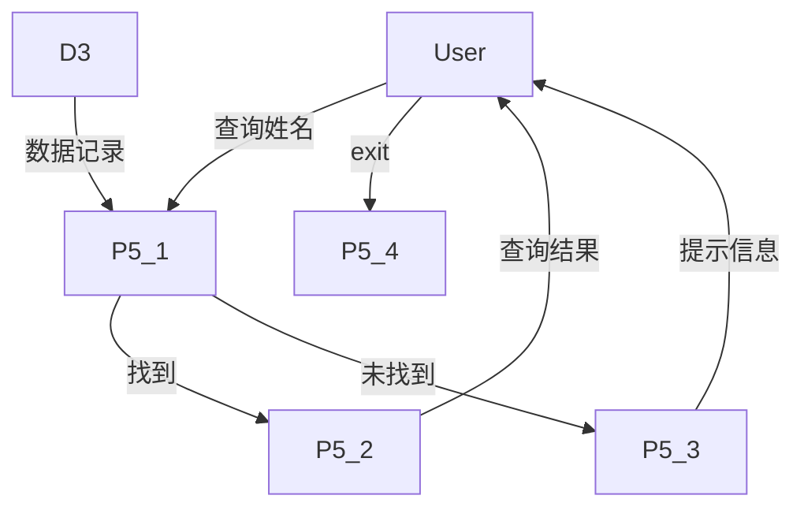

### 数据字典

| 数据流名称 | 来源 | 去向 | 数据结构 |
| :--- | :--- | :--- | :--- |
| 人数输入 | 用户 | 1.1 信息录入 | n (整数, 1-50) |
| 应聘者信息 | 用户 | 1.1 信息录入 | 姓名+性别+年龄+学历+工作年限+单位 |
| 考试成绩 | 用户 | 1.1 信息录入 | 政策+语文+英语+计算机+口试 |
| 验证后数据 | 1.1 信息录入 | D1 | 完整应聘者记录 |
| 各项得分 | 1.2 分数计算 | D2 | 学历分+年龄分+工作分+总分 |
| 排序数据 | 1.3 排序处理 | D3 | 按总分降序排列的记录 |
| 成绩总表 | 1.4 报表输出 | 用户 | 格式化表格 |
| 录取通知 | 1.4 报表输出 | 用户 | 前 5 名信息 |
| 查询姓名 | 用户 | 1.5 信息查询 | 姓名字符串 |
| 查询结果 | 1.5 信息查询 | 用户 | 详细信息或错误提示 |

## 程序结构图

系统采用模块化设计，主模块协调三个子模块完成全部功能：

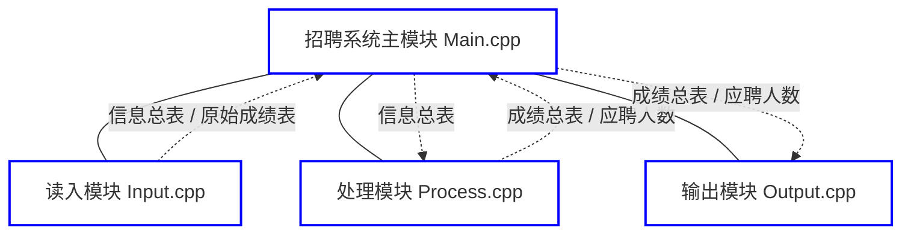

各模块的职责如下：

| 模块 | 功能描述 |
| :--- | :--- |
| 输入模块 | 读取应聘者人数和详细信息 |
| 计算模块 | 计算学历分、年龄分、工作分、总分 |
| 排序模块 | 按总分从高到低排序 |
| 输出模块 | 显示成绩表和录取通知书 |
| 查询模块 | 支持按姓名查询应聘者信息 |

## 核心功能流程图

### 学历分计算

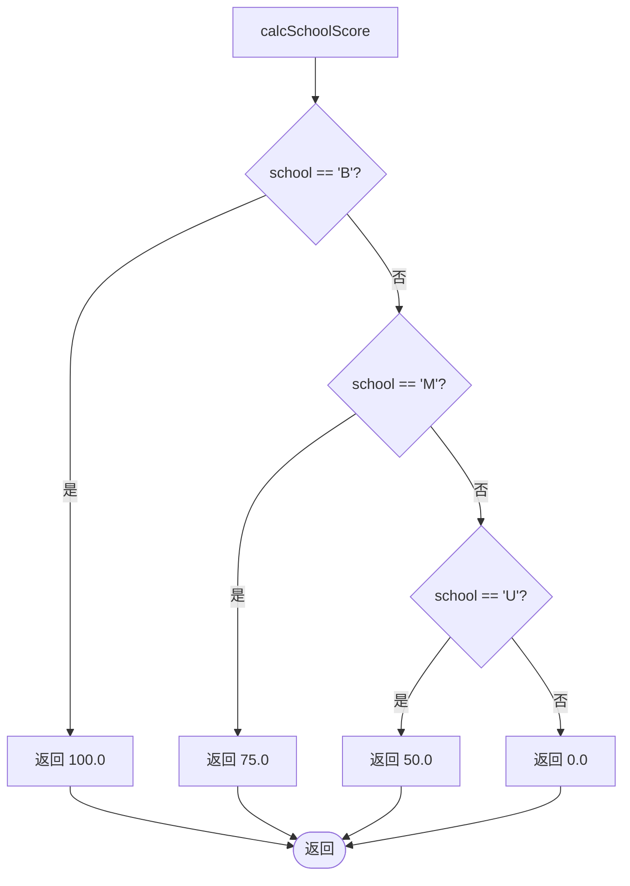

### 年龄分计算

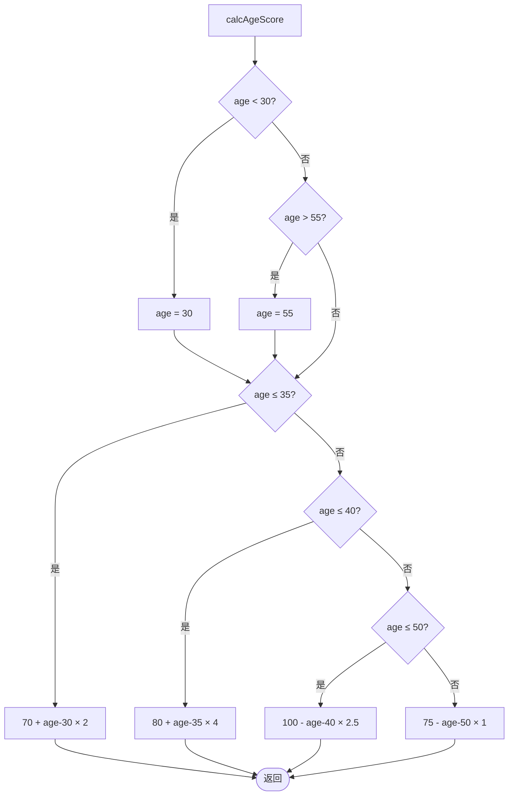

### 工作经历分计算

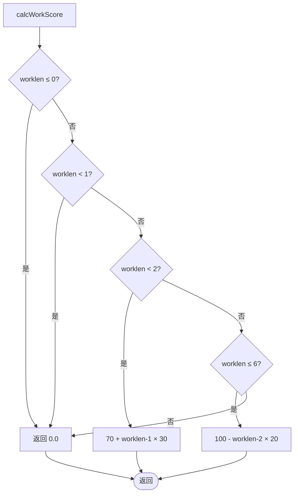

### 总分计算

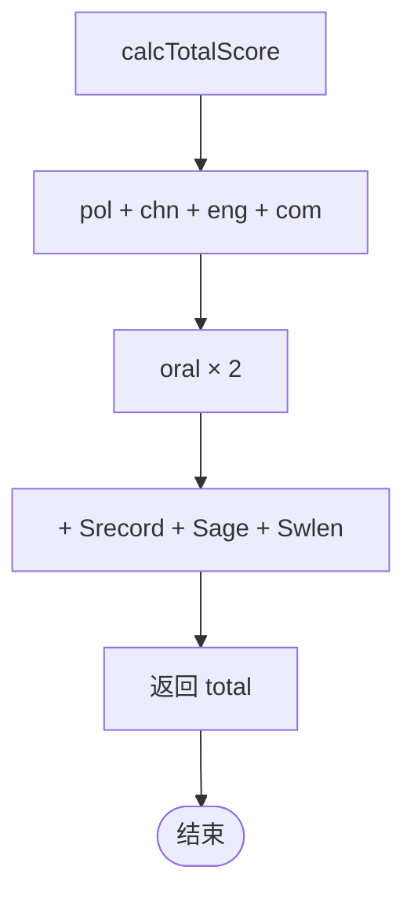

### 程序整体流程

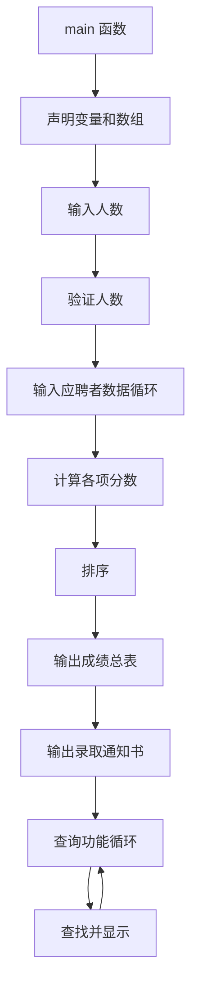

## 初版核心代码

下面是系统的初版完整实现，所有功能集中在一个文件中，便于理解整体逻辑：

```cpp
#include <iostream>  
#include <cstring>  
#include <algorithm>  
#include <iomanip>  
using namespace std;  
  
// 定义考试成绩结构体  
struct Tmark {  
    float pol;  // 政策法律基础  
    float chn;  // 语文  
    float eng;  // 英语  
    float com;  // 计算机基础  
    float oral; // 口试  
};  
  
// 定义应聘者个人信息结构体  
struct Tinform {  
    char name[20];           // 姓名  
    char sex;                // 性别  
    float age;               // 年龄  
    char schoolrecord;       // 学历  
    float worklen;           // 任科级干部年限  
    char wordsite[60];       // 现工作单位  
    Tmark mark;              // 考试成绩  
};  
  
// 定义应聘者信息和考试成绩结构体  
struct Tmarks {  
    Tinform info;  
    char name[20];           // 姓名  
    float Sage;              // 年龄分  
    float Srecord;           // 学历分  
    float Swlen;             // 工作经历分  
    Tmark mark;              // 考试成绩  
    float total;             // 总分  
};  
  
// 计算学历分  
float calcSchoolScore(char school) {  
    switch(school) {  
        case 'B': return 100.0; // 博士  
        case 'M': return 75.0;  // 硕士  
        case 'U': return 50.0;  // 本科  
        default: return 0.0;    // 其他  
    }  
}  
  
// 计算年龄分（线性插值）  
float calcAgeScore(float age) {  
    if (age < 30) age = 30;  
    if (age > 55) age = 55;  
  
    if (age <= 35) {  
        return 70.0 + (age - 30) * 2.0;  
    } else if (age <= 40) {  
        return 80.0 + (age - 35) * 4.0;  
    } else if (age <= 50) {  
        return 100.0 - (age - 40) * 2.5;  
    } else {  
        return 75.0 - (age - 50) * 1.0;  
    }  
}  
  
// 计算工作经历分  
float calcWorkScore(float worklen) {  
    if (worklen <= 0) {  
        return 0.0;  
    } else if (worklen < 1) {  
        return 0.0;  
    } else if (worklen < 2) {  
        return 70.0 + (worklen - 1) * 30.0;  
    } else if (worklen <= 6) {  
        return 100.0 - (worklen - 2) * 20.0;  
    } else {  
        return 0.0;  
    }  
}  
  
// 计算总分  
float calcTotalScore(Tmarks &applicant) {  
    float written_total = applicant.mark.pol + applicant.mark.chn + applicant.mark.eng + applicant.mark.com;  
    float oral_score = applicant.mark.oral * 2;  
    return written_total + oral_score + applicant.Srecord + applicant.Sage + applicant.Swlen;  
}  
  
// 按总分从高到低排序  
bool compareByTotal(const Tmarks &a, const Tmarks &b) {  
    return a.total > b.total;  
}  
  
int main() {  
    const int MAX_APPLICANTS = 50;  
    Tmarks applicants[MAX_APPLICANTS];  
    int n;  
  
    // 输入应聘者数量  
    cout << "请输入应聘者人数 (不超过50): ";  
    cin >> n;  
    if (n <= 0 || n > MAX_APPLICANTS) {  
        cout << "输入人数无效！" << endl;  
        return 1;  
    }  
  
    // 输入应聘者信息  
    cout << "\n请依次输入每位应聘者的信息（姓名 性别 年龄 学历 任科级干部年限 现工作单位 政策法律基础 语文 英语 计算机基础 口试）：" << endl;  
    for (int i = 0; i < n; i++) {  
        cout << "应聘者 #" << i+1 << ": ";  
        cin >> applicants[i].name >> applicants[i].info.sex >> applicants[i].info.age >> applicants[i].info.schoolrecord  
             >> applicants[i].info.worklen >> applicants[i].info.wordsite  
             >> applicants[i].mark.pol >> applicants[i].mark.chn  
             >> applicants[i].mark.eng >> applicants[i].mark.com  
             >> applicants[i].mark.oral;  
  
        // 计算各项分数  
        applicants[i].Srecord = calcSchoolScore(applicants[i].info.schoolrecord);  
        applicants[i].Sage = calcAgeScore(applicants[i].info.age);  
        applicants[i].Swlen = calcWorkScore(applicants[i].info.worklen);  
        applicants[i].total = calcTotalScore(applicants[i]);  
    }  
  
    // 按总分排序  
    sort(applicants, applicants + n, compareByTotal);  
  
    // 输出成绩总表  
    cout << "\n成绩总表（按总分从高到低排序）：" << endl;  
    cout << left << setw(15) << "姓名" << setw(10) << "政策法律" << setw(10) << "语文"  
         << setw(10) << "英语" << setw(10) << "计算机" << setw(10) << "口试"  
         << setw(10) << "学历分" << setw(10) << "年龄分" << setw(10) << "工作分" << setw(10) << "总分" << endl;  
    cout << "----------------------------------------------------------------------------------------------" << endl;  
  
    for (int i = 0; i < n; i++) {  
        cout << left << setw(15) << applicants[i].name  
             << setw(10) << fixed << setprecision(2) << applicants[i].mark.pol  
             << setw(10) << applicants[i].mark.chn  
             << setw(10) << applicants[i].mark.eng  
             << setw(10) << applicants[i].mark.com  
             << setw(10) << applicants[i].mark.oral  
             << setw(10) << applicants[i].Srecord  
             << setw(10) << applicants[i].Sage  
             << setw(10) << applicants[i].Swlen  
             << setw(10) << applicants[i].total << endl;  
    }  
  
    // 输出录取通知书  
    int numToRecruit = min(5, n);  
    cout << "\n录取通知书（前" << numToRecruit << "名）：" << endl;  
    cout << "----------------------------------------------------------------------------------------------" << endl;  
    for (int i = 0; i < numToRecruit; i++) {  
        cout << "恭喜 " << applicants[i].name << " 被录取为副局长！" << endl;  
        cout << "录取信息：总分 " << fixed << setprecision(2) << applicants[i].total << " 分" << endl;  
        cout << "----------------------------------------------------------------------------------------------" << endl;  
    }  
  
    // 查询功能  
    char queryName[20];  
    cout << "\n请输入要查询的姓名（输入'exit'退出查询）: ";  
    while (cin >> queryName) {  
        if (strcmp(queryName, "exit") == 0) break;  
  
        bool found = false;  
        for (int i = 0; i < n; i++) {  
            if (strcmp(applicants[i].name, queryName) == 0) {  
                cout << "\n查询结果：" << endl;  
                cout << "姓名: " << applicants[i].name << endl;  
                cout << "政策法律: " << fixed << setprecision(2) << applicants[i].mark.pol << endl;  
                cout << "语文: " << applicants[i].mark.chn << endl;  
                cout << "英语: " << applicants[i].mark.eng << endl;  
                cout << "计算机: " << applicants[i].mark.com << endl;  
                cout << "口试: " << applicants[i].mark.oral << endl;  
                cout << "学历分: " << applicants[i].Srecord << endl;  
                cout << "年龄分: " << applicants[i].Sage << endl;  
                cout << "工作经历分: " << applicants[i].Swlen << endl;  
                cout << "总分: " << applicants[i].total << endl;  
                found = true;  
                break;  
            }  
        }  
  
        if (!found) {  
            cout << "未找到姓名为 " << queryName << " 的应聘者！" << endl;  
        }  
  
        cout << "\n请输入要查询的姓名（输入'exit'退出查询）: ";  
    }  
  
    return 0;  
}
```

## 使用说明书

以下是系统正式版的操作指南。正式版将代码拆分为多个模块文件，并增加了数据持久化功能。

### 编译与运行

将以下源文件和头文件放在同一目录下：

| 类型 | 文件名 |
| :--- | :--- |
| 头文件 | struct.h、Input.h、Process.h、Output.h、compareByTotal.h、FileIO.h |
| 源文件 | main.cpp、struct.cpp、Input.cpp、Process.cpp、Output.cpp、compareByTotal.cpp、FileIO.cpp |

以 GCC 为例，编译命令：

```bash
g++ -std=c++11 main.cpp struct.cpp Input.cpp Process.cpp Output.cpp compareByTotal.cpp FileIO.cpp -o applicant_system
```

### 功能操作

程序启动后自动加载本地数据文件 `applicants_data.txt`，若无该文件则创建空列表；退出时自动保存。主菜单选项：

1. **输入应聘者信息**：输入人数后逐个录入，录入完成后自动计算各项分数
2. **显示所有应聘者信息**：按总分从高到低排序，以表格形式展示
3. **显示录取通知书**：自动选取前 5 名生成录取通知
4. **查询应聘者信息**：输入姓名检索，输入 `exit` 退出查询
0. **退出系统**：自动保存数据后退出

### 常见问题

- **无法打开文件进行写入**：检查程序运行目录是否有写入权限
- **显示列表无数据**：确认输入的应聘者人数 ≥ 1 且完成了所有字段录入
- **查询提示未找到**：核对姓名是否与录入时完全一致（区分大小写和空格）
- **输入数值后程序卡死**：可能输入了非数字字符，关闭程序重新运行

### 注意事项

- 姓名和工作单位字段不支持空格
- 性别、学历仅支持指定大写字符（M/W、B/M/U/O）
- 运行过程中请勿删除 `applicants_data.txt`，否则会丢失历史数据

## 小结

回顾整个课程设计，有几个关键收获：

1. **结构体嵌套设计**：通过 `Tmark → Tinform → Tmarks` 三层嵌套，将原始数据与计算结果分离，既保持了数据的完整性，又避免了重复字段
2. **分段线性插值**：年龄分的计算用到了分段函数，边界处理（clamp）是关键，先限制范围再计算可以避免大量条件判断
3. **模块化拆分**：从单文件版本演进到多文件版本，每个 `.cpp` 对应一个功能模块，配合头文件声明，使代码结构更清晰
4. **数据持久化**：通过 `<fstream>` 实现文件的读写，让程序具备了"记忆"能力，这是从纯算法练习迈向实际应用的 important step
5. **测试驱动**：编写测试用例的过程中发现了 `Application_Count` 函数的逻辑反转 bug，说明测试不仅是验证手段，更是发现设计缺陷的工具
