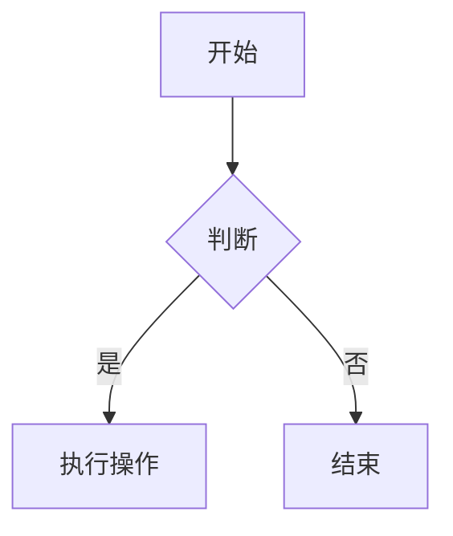
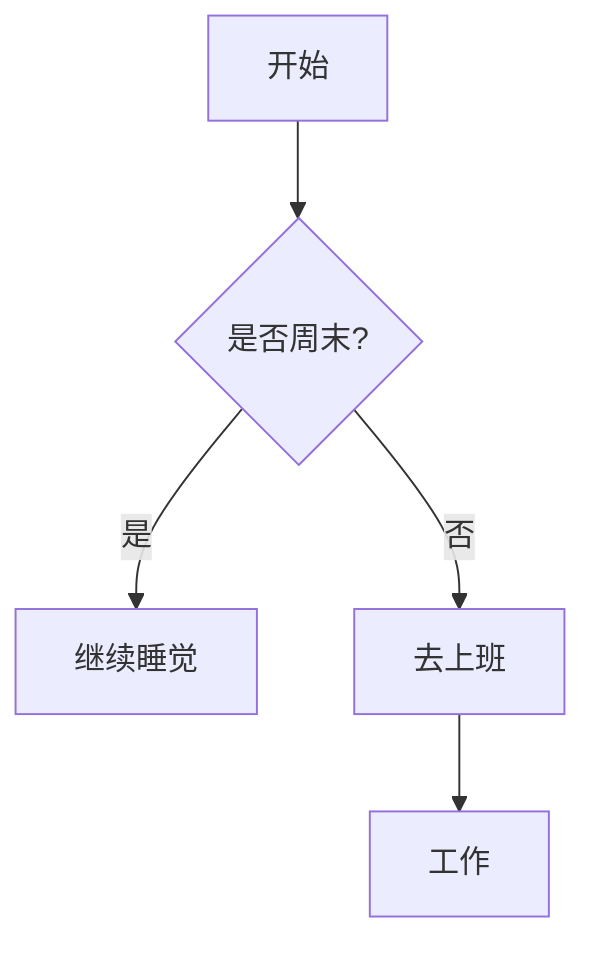
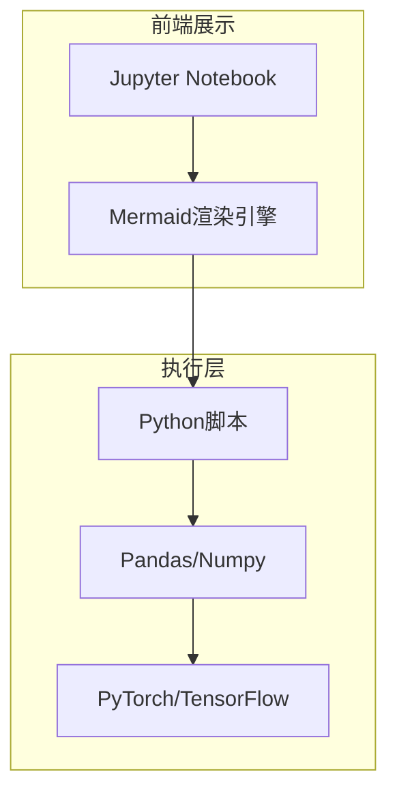
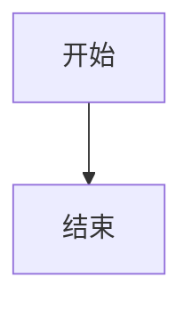

在技术文档和学习笔记中，流程图是最常用的可视化工具之一。传统做法是用 Visio 或 draw.io 画图再导出图片，但这样既不便于版本控制，修改起来也麻烦。Mermaid 提供了一种更好的方式：用纯文本语法描述图表，让流程图像代码一样可编辑、可追踪、可维护。这篇文章带你从零掌握在 Markdown 中使用 Mermaid 画流程图的核心技能。

## 基本结构

在 Markdown 中使用 Mermaid，只需将代码包裹在 ` ```mermaid ` 代码块中：



`graph` 后面的参数定义了流程图的布局方向：

- **TD / TB**：从上到下（Top Down）——最常用
- **LR**：从左到右（Left Right）——最常用
- **RL**：从右到左
- **BT**：从下到上

选择合适的方向能让流程图更易读。一般来说，线性流程用 LR，带分支的判断逻辑用 TD。

## 节点形状

不同的括号代表不同形状的节点，根据含义选择合适的形状能让图表更专业：

| 语法 | 形状 | 适用场景 |
| :--- | :--- | :--- |
| `A[矩形]` | 🟦 矩形 | 普通步骤、处理过程 |
| `B(圆角矩形)` | 🟊 圆角矩形 | 开始、结束 |
| `C{菱形}` | 🔲 菱形 | 判断、决策 |
| `D((圆形))` | 🔴 圆形 | 连接点 |
| `E[/平行四边形/]` | ▱ 平行四边形 | 输入/输出 |

## 连接线样式

Mermaid 提供了多种连接线来表达不同的关系：

- `-->` ：带箭头实线（最常用）
- `---` ：无箭头实线
- `-.-` ：虚线
- `==>` ：加粗箭头（用于强调关键路径）
- `A -->|文字| B` ：在箭头上添加标注文字

## 实用示例

### 简单线性流程


### 带判断的分支流程



### 使用子图分组

当流程涉及多个模块时，可以用 `subgraph` 把相关节点归组：



子图让复杂的系统架构图层次分明，读者一眼就能看出哪些组件属于同一个模块。


## 自定义样式

Mermaid 支持通过 `style` 命令自定义节点的填充色、边框色等属性：


此外，可以用 `%%` 添加注释，注释不会影响图表渲染：



## 环境与工具

### VS Code

安装 **Mermaid Preview** 或 **Markdown Preview Mermaid Support** 插件后，在 Markdown 预览中即可实时看到图表。右键选择"Open Preview to the Side"可以边写边看。

### 在线编辑器

[Mermaid Live Editor](https://mermaid.live/) 是最方便的调试工具——左边写代码，右边实时预览，还支持导出 PNG/SVG。遇到语法报错时，先用它验证比在编辑器里反复编译高效得多。

### GitHub

GitHub 原生支持 Mermaid，直接在 `.md` 文件中写 ` ```mermaid ` 代码块即可渲染，无需额外配置。

> **注意**：微信公众号编辑器等平台不支持 Mermaid。这种情况下需要先在支持的工具中生成图片，再以图片形式插入文章。

## 实用技巧

- **命名规范**：为节点起有意义的 ID（如 `Login[登录]`），而不是用 A、B、C。后续维护和团队协作时会感谢自己。
- **版本控制**：Mermaid 图表是纯文本，可以直接纳入 Git，比图片格式更容易追踪变更历史。
- **AI 辅助**：可以让 ChatGPT 等 AI 工具生成 Mermaid 代码，输入类似"为用户登录流程画一个流程图"的提示即可获得初稿，再手动调整细节。

## 小结

- Mermaid 用纯文本语法描述图表，天然适合版本控制和协作。
- 掌握 `graph` 方向、节点形状、连接线三种基础语法就能覆盖大多数流程图需求。
- 子图（`subgraph`）和自定义样式让复杂架构图也能清晰呈现。
- VS Code 插件和 Mermaid Live Editor 是两个最常用的开发工具。
- 注意目标平台的兼容性，不支持 Mermaid 的平台需要先导出图片。
